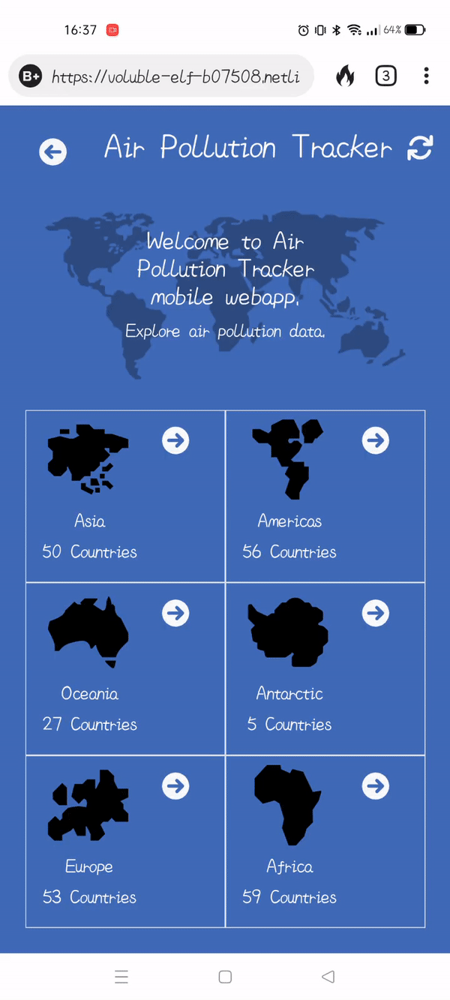

# Title-Info
> Air pollution Tracker is basically a mobile app application which tracks the data of air  `from Air Pollution Api` of a specific country `from Rest Countries API` based on their continent.

# GIF

## Built With
- React
- Redux
- Bootstrap
- CSS
- Fontawesome
- Netlify for live page

## Live Demo
For the link to the live demo, [Click here](https://voluble-elf-b07508.netlify.app/)

## Getting Started
To get a local copy up and running you just need to follow the following steps;
- Clone this repository with
git clone `https://github.com/Tufahel/air-pollution-tracker.git` using your terminal or command line.
- run code `.` to open it in vscode.
- run `npm install` in terminal.
- run `npm run build`.
- run `npm start`.

## Authors

👤 **Author: Tufahel**

- GitHub: [@Tufahel](https://github.com/Tufahel)
- Twitter: [@TufahelAhmed](https://twitter.com/TufahelAhmed)
- LinkedIn: [@Tufahel-Ahmed](https://www.linkedin.com/in/tufahel-ahmed/)

## 🤝 Contributing

Contributions, issues, and feature requests are welcome!

Feel free to check the [issues page](../../issues/).

## Show your support

Give a ⭐️ if you like this project!

## Acknowledgments

- I have followed this [Design Guideline](https://www.behance.net/gallery/31579789/Ballhead-App-(Free-PSDs))
- Original desing idea by [Nelson Sakwa on Behance](https://www.behance.net/sakwadesignstudio)

## 📝 License

This project is [MIT](./MIT.md) licensed.
